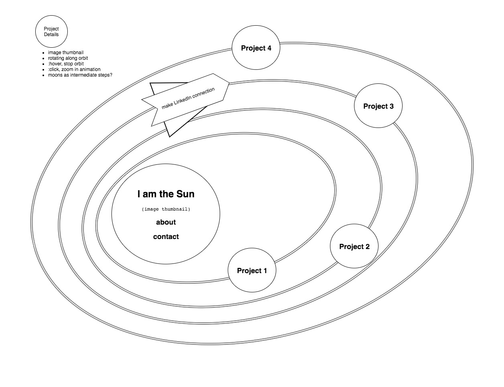

# About senbenito's portfolio
This repoistory started life as a 15-minute warmup during my [Web Development Immersive at Galvanize, Boulder](https://www.galvanize.com/boulder/web-development "Galvanize Boulder shoutout").
##### Learn more about my time @ Galvanize: [const senbenito = { ... g[49].16 }](https://talent.galvanize.com/students/1556 "Galvanize Talent link")

Originally intended as a simple listing of select, deployed projects, this portfolio will be used to document my on-going developer development as I learn and apply new technologies.

## Step 1: a front-end...
I selected [React.js](https://facebook.github.io/react/) because:
1. it was the most-recent framework we studied
2. I loved developing our cross-cohort React hackathon app: [Gela.To](https://github.com/lerning/gelato)
3. there were a number of on-campus resources proficient in React
4. it's the 'new cool'
5. [create-react-app](https://www.npmjs.com/package/create-react-app)

At this point, React is probably overkill to display a few `<iframe>`s, but I am a fan of the [Polymorphism Principle of Object-Oriented Programming (POOP) (and its dependency Inheritance)](https://stackoverflow.com/a/27642444 "Travis J on StackOverflow") and React embodies this ability of object-oriented languages like Javascript to instantiate new Object classes / "children" / component by extending an original / "parent" / app Object ensuring plug&play component compatability (kinda like my old NES but fixing problems with React console instead of blowing on cartridges). So I can find amazing NPM modules that someone else has created and wire them up to extend my portfolio's functionality - cool!!

Those [`<iframe>`s](https://developer.mozilla.org/en-US/docs/Web/HTML/Element/iframe "refer to the MDN docs") tho... I recognized the power of a simple `<iframe>` during that [React-a-thon](https://github.com/lerning/gelato) - you can just supply a URI with API key as the src - so I wanted to bring them in here. Who knows, we may find future advances replacing the `<iframe>`s but for now, I like their simplicity and literal window into another world...

At this point, we have a simple front-end, so let's deploy to [Surge](http://surge.sh/) for a quick preview: [senbenito's portfolio](http://senbenito-portfolio.surge.sh/ "basic front-end on surge.sh"). This was a super-simple deployment thanks to create-react-app's `yarn build` command. Just `surge` in the `build` directory and **POOF!** ... *website*.
>Git branch [master](https://github.com/senbenito/portfolio-frontend)

## Step 2: let's get dynamic!
I knew I wasn't done making websites and wanting to show them off. Rather than manually add in a new `<iframe>` each time I make a new site to rebuild and redeploy, I took a lesson from my [Serene MVP](https://github.com/adam-serene/serene-mvp) Google Map integration and decided to query a [Knex.js](http://knexjs.org/) [PostgreSQL](https://www.postgresql.org/) database via a RESTful [Express.js](https://expressjs.com/) server. This way, I can just [.map()](https://developer.mozilla.org/en-US/docs/Web/JavaScript/Reference/Global_Objects/Array/map) a data array of submitted websites into those beloved `<iframe>`s.

Here's the [personal-server](https://github.com/senbenito/personal-server) repo to dive into this crucial step.

HOLD ON! Someone else could Post to my website database, so let's bring in some basic authentication via [BcryptJS](https://www.npmjs.com/package/bcryptjs) and allow user persistence via [JSON Web Tokens](https://www.npmjs.com/package/jsonwebtoken).
_note: I started out with Bcrypt, but ELF header errors plagued my Heroku build, so I finally found BcryptJS which is slower... but works!_

Which brings up an interesting 'problem': I've created a couple components to deal with (portfolio, login, submit website) so let's add [React Router DOM](https://www.npmjs.com/package/react-router-dom) to take care of rendering components as needed!
>Git branch [react-router](https://github.com/senbenito/portfolio-frontend/tree/react-router)

Way back on my Q1 Project, [Eatertain.Me](http://eatertain_me.surge.sh/), I had a [chicken GIF](https://captaintoog.deviantart.com/) easter egg that would display chicken recipes. It became a "thing" that we'd sneak the chicken into our quarterly projects [Family Hub: add 'chicken' to grocery list and mark it done](https://familyhub.herokuapp.com/), [ReZact Hunter: click on Difficulty Level bar to face Chicken Boss](https://github.com/zpassarelli/rezact-hunter), [Serene: click the chicken icon to view chicken restaurants](https://serene-green.herokuapp.com/chickenplaces) - so as an ode to my friends-forever from g[49], my login bar is accessed by clicking the chicken.
>Git branch [chicken-login](https://github.com/senbenito/portfolio-frontend/tree/chicken-login)

At this point, I'm loving Polymorphism because I've just added some serious backend functionality with a few NPM packages; rock on modularity!!!

## Step 3: _very_ basic styling
My plan is to integrate some [Sass](http://sass-lang.com/) CSS framework shortly, but even I see the site is looking like only I can love it...

So I've animated my chicken GIF to run around and make it bothersome to login, and used my favorite CSS font effect, [neon glow](https://codepen.io/FelixRilling/pen/qzfoc) and thrown a little texture and imagery into the site.
>Git branch [super-basic-styling](https://github.com/senbenito/portfolio-frontend/tree/super-basic-styling)

It was at this point I realized that rather than replace the portfolio component upon successful login, it would make more sense to just replace the login with the submission form instead. React rocks because I can just toggle these swap around where these components are toggled and rendered... voila! I'm going to save the AddWebsite component skeleton & routing to point to the About page that will store this recap ;)
>Git branch [refactor-login-add](https://github.com/senbenito/portfolio-frontend/tree/refactor-login-add)

## Step 4: revamp the display functionality
As alluded to earlier, it's time to fix up the `<iframe>`s. Displaying a list of my sites to select one that will display in a single `<iframe>` is going to cut down on load-time as well as hide all those console errors from the sites. Getting back to Bootstrap 4 via [reactstrap](https://reactstrap.github.io/) seems like a good jumping off point because of components like Jumbotron, Modal and Cards...

But there's a known [issue](https://github.com/reactstrap/reactstrap/issues/502) with reactstrap modals which means I'll use [react-modal](https://www.npmjs.com/package/react-modal)!

And then I remember this sketch I made of my portfolio site back in Q2, so now I've gotta make my site ... 'out of this world' ([r/dadjokes](https://www.reddit.com/r/dadjokes/)):

A quick search on [CSS-Tricks]() gave me a basic [orbiting planet framework](https://codepen.io/alandunning/pen/bNNRvQ) I could tinker with, which I did - [A LOT](#step-5:-the-joys-of-building-a-solar-system).
>Git branch [revamp-portfolio-display](https://github.com/senbenito/portfolio-frontend/tree/revamp-portfolio-display)

## Step 5: the joys of building a solar system
Since this orbiting display is literally the centerpiece of this site, we should make it pretty AND functional.

I noticed the orbit `
`s wouldn't allow clicking when I used JSX to `.map()` over the website array I got back from the server. So I started splitting out `<Planet />`s from `<Orbit />`, and then thought `<PlanetMoon />`s and `<PlanetRings>`s would be cool.

It was in here that I swapped out the controlled input on the `<Login />` for an [uncontrolled input](https://goshakkk.name/controlled-vs-uncontrolled-inputs-react/) which took care of that losing focus after each keypress; "control only what you need to."

Tinkering with all those CSS values and effects, I stumbled on a neat way of gimballing my planets so they're always up: **counter-rotation**! If you rotate an object at the same rate widdershins as the object's orbit proceeds deasil, the top will always point up; thanks... Euclid?

Right about the sixth update of the `fourth-orbit`, I realized [Sass](http://sass-lang.com/) would have made this iteration so much easier, but I like poking around in raw CSS to grok how these properties work - which led to this kinda super-cool "black hole" animation that will become my `<About />` link.

My [bouncing chicken](#-Step-3:-very-basic-styling) is getting a little ridiculous with all this celestial whirling, and I'm a little tired of chasing the thing around... let's just strand our chicken out in the furthest reaches of space to ponder an age-old question!

This chicken toggle is pretty awesome:
+ from a great-great-grandchild component, `<PlanetMoon />`, a `state` change is propogated up to `App`
+ and then back down to another grandchild component, `<Login />`

Passing `props` in `{ Route } from 'react-router-dom'` is a no-go, so this sweet npm package, [react-router-with-props](https://www.npmjs.com/package/react-router-with-props) saved the day with `{ PropsRoute }`. It even has a `{ PrivateRoute }` module for auth; we'll have to remember that when we get to `<About />` and some of the [OAuth2](https://oauth.net/2/) via [Passport.js](http://passportjs.org/) linking I'm scheming on for [LinkedIn](https://developer.linkedin.com/docs/oauth2), [Goggle](https://developers.google.com/identity/protocols/OAuth2), [GitHub](https://developer.github.com/apps/building-integrations/setting-up-and-registering-oauth-apps/)....

That said, any much further and we should bring in [Redux](http://redux.js.org/) to easily manage `state` from one central container.
>Git branch [orbit-component](https://github.com/senbenito/portfolio-frontend/tree/orbit-component)
